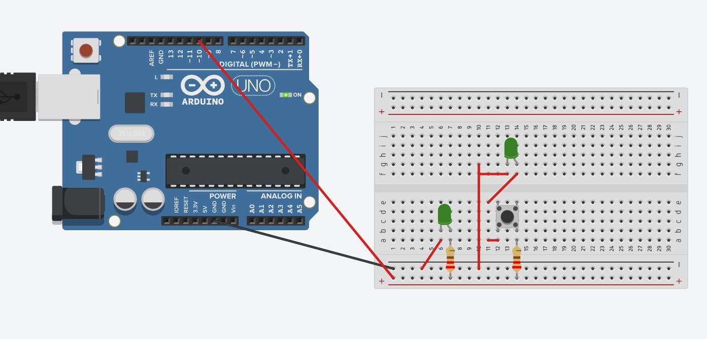
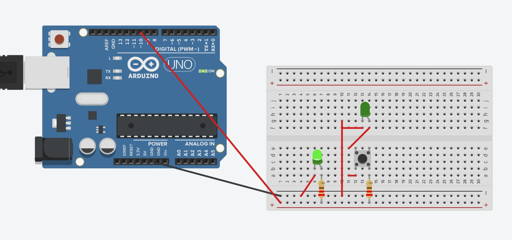
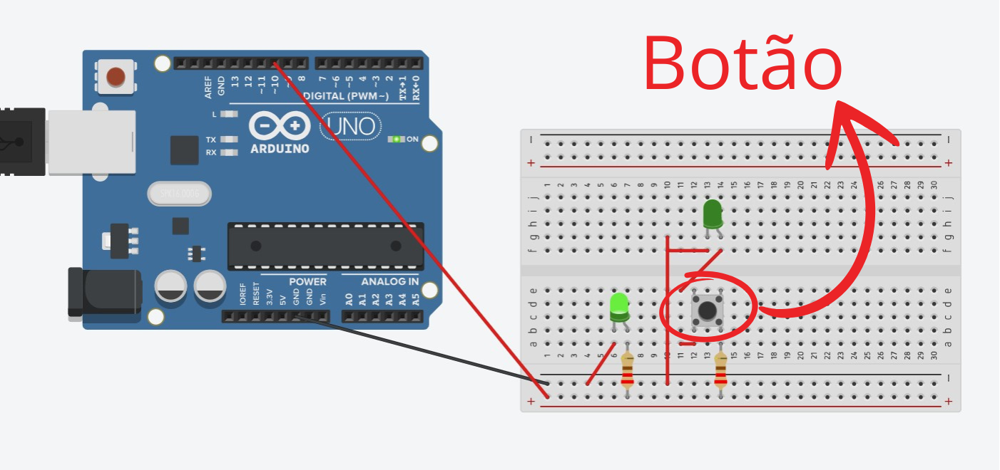
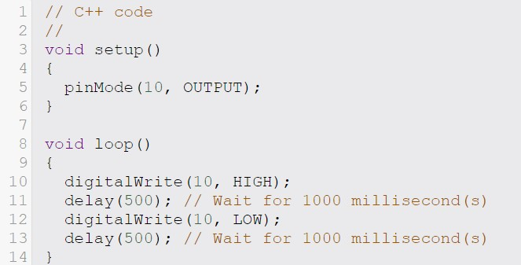

# Parte 2 Blink Led Offboard Arduino
Este repositório contém um projeto que simula um circuito e código no TinkerCAD para controlar dois LEDs externos (offboard) conectados em paralelo a um Arduino. O circuito faz com que os LEDs pisquem a cada 500 milissegundos (0,5 segundo). Um dos LEDs possui um botão que, enquanto pressionado, permite ativar ou desativar o seu piscar, oferecendo controle manual sobre o funcionamento do LED. [Link Para Projeto no TinkerCAD](https://www.tinkercad.com/things/hEZcRRMzEgQ-led-blink-offboard/editel?returnTo=https%3A%2F%2Fwww.tinkercad.com%2Fdashboard&sharecode=bzt7QuECTYUGY0qkqGZLtuW-DkXVtX4Nd3_Vm0kVE0c).

### Arduino no TinkerCad
Arduino e circuito montado no TinkerCAD. O circuito é composto pelo arduino, dois leds, dois resistores, um botão, e cabos jumper. Foi utilizada a porta 10 do Arduino em vez da porta 13.
<div align="center">
    
    <br>
    <sup>Imagem do Arduino 1 - Fonte: TinkerCAD</sup>
</div>

<div align="center">
    
    <br>
    <sup>Imagem do Arduino 2 - Fonte: TinkerCAD</sup>
</div>

<div align="center">
    
    <br>
    <sup>Imagem do Arduino 3 - Fonte: TinkerCAD</sup>
</div>

### Imagem do Código
Aqui está o código no TinkerCAD:
<div align="center">
    
    <br>
    <sup>Imagem do Código - Fonte: TinkerCAD</sup>
</div>

### Código
Aqui está o código:
``` C
// C++ code
//
void setup()
{
  pinMode(10, OUTPUT);
}

void loop()
{
  digitalWrite(10, HIGH);
  delay(500); // Wait for 1000 millisecond(s)
  digitalWrite(10, LOW);
  delay(500); // Wait for 1000 millisecond(s)
}
```

### Link TinkerCAD
[Link Para Projeto no TinkerCAD](https://www.tinkercad.com/things/hEZcRRMzEgQ-led-blink-offboard/editel?returnTo=https%3A%2F%2Fwww.tinkercad.com%2Fdashboard&sharecode=bzt7QuECTYUGY0qkqGZLtuW-DkXVtX4Nd3_Vm0kVE0c)


